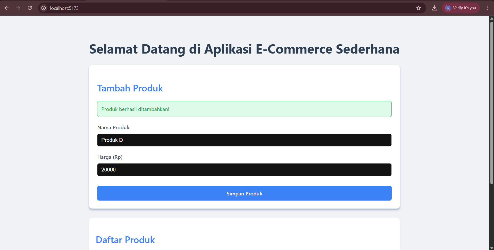
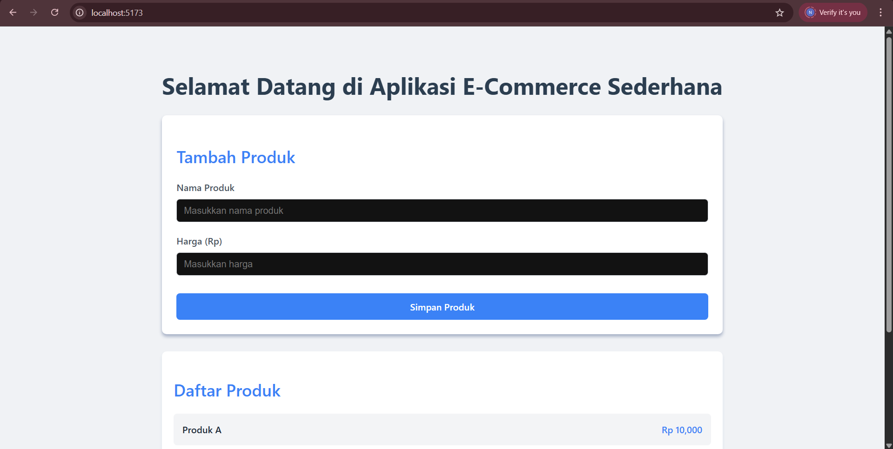
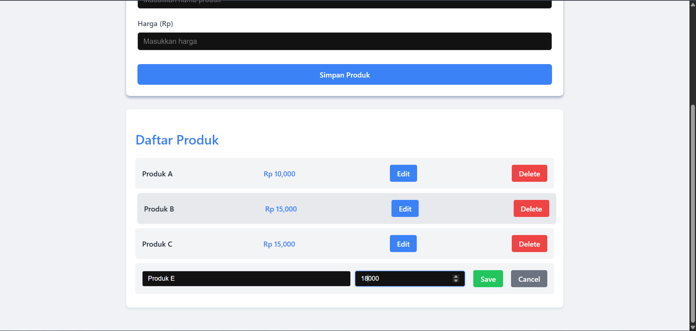
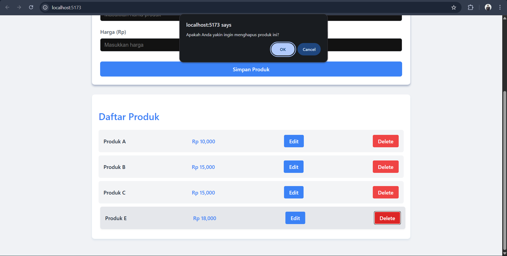
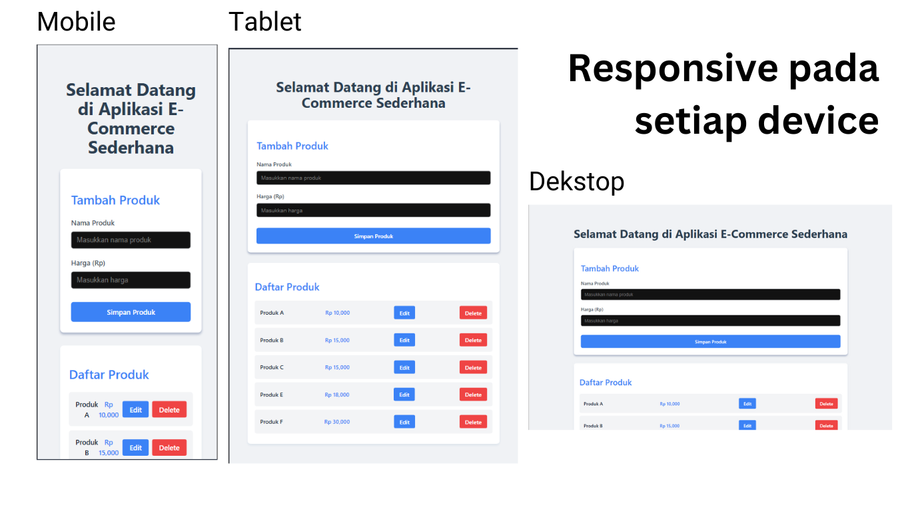

## Nama  : Adam Ibnu Ramadhan
## NIM   : 10231003
## Pemrograman Web

------------------------------------------------------------------------------------------------------------------------------------------------------------------------------------------------------------------------------------------------------------

# 🛍️ Sistem Manajemen E-Commerce Sederhana
## Link Repository : https://github.com/shxroi/proweb

## 📝 Deskripsi Aplikasi
Aplikasi Web Manajemen E-Commerce Sederhana dirancang untuk membantu pengguna dalam mengelola daftar produk dengan lebih efisien. Dengan antarmuka yang user-friendly, pengguna dapat dengan mudah melihat, menambahkan, memperbarui, dan menghapus produk beserta detail seperti nama dan harga. Pengembangan aplikasi ini berfokus pada kemudahan navigasi serta performa yang optimal.

------------------------------------------------------------------------------------------------------------------------------------------------------------------------------------------------------------------------------------------------------------

## 🛠️ Teknologi yang Digunakan

### Frontend
- **⚛️ React.js dengan TypeScript**
  - Menggunakan Vite sebagai alat build
  - TypeScript untuk keamanan tipe
  - React Hooks untuk manajemen state
- **🌐 Axios**
  - HTTP client untuk berkomunikasi dengan API
  - Penanganan error yang kuat
- **🎨 CSS**
  - Styling modern dengan flexbox
  - Desain responsif
  - Animasi dan transisi yang halus

### Backend
- **🚀 Node.js & Express.js**
  - Arsitektur RESTful API
  - Middleware untuk CORS dan penanganan error
- **💾 MySQL**
  - Database relasional
  - Query yang dioptimalkan


------------------------------------------------------------------------------------------------------------------------------------------------------------------------------------------------------------------------------------------------------------

## ⚙️ Persyaratan Sistem
- Node.js v14 atau lebih tinggi
- MySQL v8.0 atau lebih tinggi
- NPM v6 atau lebih tinggi

------------------------------------------------------------------------------------------------------------------------------------------------------------------------------------------------------------------------------------------------------------

## 📦 Instruksi Instalasi
1. Clone repository ini
   ```bash
   git clone [URL_REPOSITORY]
   cd proweb
   ```

2. Setup Database
   - Buat database MySQL baru
   - Import schema dari file `schema.sql` (jika tersedia)
   - Konfigurasi kredensial di `db.js`

3. Install dependencies untuk frontend:
   ```bash
   cd proweb-frontend
   npm install
   ```

4. Install dependencies untuk backend:
   ```bash
   cd proweb-backend
   npm install
   ```

5. Konfigurasi Environment
   - Buat file `.env` di folder backend
   - Isi dengan konfigurasi yang diperlukan:
     ```
     DB_HOST=localhost
     DB_USER=your_username
     DB_PASSWORD=your_password
     DB_NAME=your_database
     PORT=3001
     ```

6. Jalankan backend:
   ```bash
   cd proweb-backend
   node index.js
   ```

7. Jalankan frontend:
   ```bash
   cd proweb-frontend
   npm run dev
   ```

------------------------------------------------------------------------------------------------------------------------------------------------------------------------------------------------------------------------------------------------------------

## 📁 Struktur Proyek
```
proweb/
├── proweb-backend/
│   ├── index.js                # Entry point backend
│   ├── db.js                   # Konfigurasi database
│   └── package.json           # Dependencies backend
├── proweb-frontend/
│   ├── src/
│   │   ├── components/
│   │   │   └── ProdukList.tsx    # Komponen utama untuk manajemen produk
│   │   ├── App.tsx              # Komponen root
│   │   └── App.css              # Styling global
│   ├── public/                  # Asset statis   
│   └── package.json            # Dependencies frontend   
└── Readme.md
```
------------------------------------------------------------------------------------------------------------------------------------------------------------------------------------------------------------------------------------------------------------

## 🔌 API Endpoints
### Produk
1. `GET /produk`
   - Mendapatkan semua produk
   - Response: Array of products
   - Status: 200 OK

2. `POST /produk`
   - Menambah produk baru
   - Body: `{ nama: string, harga: number }`
   - Response: Created product
   - Status: 201 Created

3. `PUT /produk/:id`
   - Mengupdate produk berdasarkan ID
   - Body: `{ nama: string, harga: number }`
   - Response: Updated product
   - Status: 200 OK

4. `DELETE /produk/:id`
   - Menghapus produk berdasarkan ID
   - Response: Success message
   - Status: 200 OK

------------------------------------------------------------------------------------------------------------------------------------------------------------------------------------------------------------------------------------------------------------

## ✨ Fitur-fitur Aplikasi

### 1. ➕ Fitur Tambah Produk


- **Form Input**
  - Field input untuk nama produk
  - Field input untuk harga produk
  - Validasi input secara real-time
  - Format harga otomatis
  - Tombol submit yang responsif

- **User Experience**
  - Form yang bersih dan intuitif
  - Validasi input yang jelas
  - Feedback visual saat mengetik
  - Status loading saat submit
  - Notifikasi sukses/gagal

- **Validasi**
  - Nama produk tidak boleh kosong
  - Harga harus berupa angka positif
  - Batas maksimum karakter untuk nama
  - Format harga sesuai standar
  - Penanganan karakter khusus

### 2. 📋 Tampilan Daftar Produk


- **Layout & Desain**
  - Grid layout untuk menampilkan produk
  - Desain kartu untuk setiap produk
  - Spacing dan padding yang konsisten
  - Warna kontras untuk meningkatkan keterbacaan

- **Fungsionalitas**
  - Auto-refresh saat data berubah
  - Sorting berdasarkan nama/harga
  - Pagination untuk data dalam jumlah besar
  - Fitur pencarian dan filter produk

### 3. ✏️ Fitur Edit Produk


- **Form Edit**
  - Inline editing untuk pengalaman pengguna yang lebih baik
  - Validasi input secara real-time
  - Format harga otomatis
  - Pratinjau perubahan sebelum menyimpan

- **User Experience**
  - Status loading saat proses edit
  - Notifikasi sukses/gagal
  - Pintasan keyboard (Esc untuk batal)
  - Auto-focus pada input pertama

### 4. 🗑️ Fitur Hapus Produk


- **Konfirmasi**
  - Modal dialog konfirmasi
  - Pesan yang jelas dan informatif
  - Opsi untuk membatalkan
  - Highlight pada produk yang akan dihapus

- **Feedback**
  - Animasi fade-out saat produk dihapus
  - Notifikasi sukses
  - Opsi undo (jika diperlukan)
  - Penanganan error yang jelas

### 5. 📱 Desain Responsif


- **Desktop (>1024px)**
  - Grid layout dengan 3 kolom
  - Efek hover
  - Fitur lengkap tersedia

- **Tablet (768px - 1024px)**
  - Grid layout dengan 2 kolom
  - Spasi yang dioptimalkan
  - Tombol yang ramah sentuhan

- **Mobile (<768px)**
  - Layout satu kolom
  - Elemen ditumpuk secara vertikal
  - Antarmuka yang dioptimalkan untuk sentuhan
  - Navigasi yang lebih sederhana


------------------------------------------------------------------------------------------------------------------------------------------------------------------------------------------------------------------------------------------------------------

## ✅ Pengujian Jaminan Kualitas

### Pengujian Operasi CRUD
1. **Membuat Produk (Create)**
   - ✅ Validasi input untuk nama produk
   - ✅ Validasi harga (harus berupa angka positif)
   - ✅ Penanganan karakter khusus
   - ✅ Umpan balik sukses/gagal
   - ✅ Auto-refresh daftar setelah produk dibuat

2. **Membaca Produk (Read)**
   - ✅ Status loading saat mengambil data
   - ✅ Penanganan kesalahan jika gagal mengambil data
   - ✅ Penanganan jika data kosong
   - ✅ Format harga yang sesuai
   - ✅ Pagination berfungsi dengan baik

3. **Mengupdate Produk (Update)**
   - ✅ Validasi input saat mengedit
   - ✅ Konfirmasi sebelum memperbarui data
   - ✅ Fitur batal edit berfungsi
   - ✅ Pembaruan UI secara real-time
   - ✅ Penanganan kesalahan jika pembaruan gagal

4. **Menghapus Produk (Delete)**
   - ✅ Konfirmasi sebelum menghapus
   - ✅ Animasi saat proses penghapusan
   - ✅ Penanganan kesalahan jika penghapusan gagal
   - ✅ UI diperbarui setelah penghapusan
   - ✅ Fitur undo delete jika diperlukan

### Pengujian UI/UX
- ✅ Responsif di berbagai ukuran layar
- ✅ Status loading yang jelas
- ✅ Pesan kesalahan yang informatif
- ✅ Notifikasi keberhasilan
- ✅ Transisi dan animasi yang halus

### Pengujian Performa
- ✅ Waktu muat awal yang cepat
- ✅ Scrolling yang lancar
- ✅ Pengambilan data yang efisien
- ✅ Optimasi re-render
- ✅ Pencegahan kebocoran memori


------------------------------------------------------------------------------------------------------------------------------------------------------------------------------------------------------------------------------------------------------------

## 🎯 Kesimpulan

Sistem Manajemen Produk ini menghadirkan solusi yang efisien dan ramah pengguna dalam mengelola data produk. Dengan mengadopsi teknologi modern serta best practices dalam pengembangan web, aplikasi ini menawarkan:
- ⚡ Kinerja yang optimal
- 👥 Pengalaman pengguna yang intuitif
- 🔒 Keamanan data yang terjaga
- 🛠️ Kemudahan dalam perawatan dan pengelolaan
- 📈 Skalabilitas untuk pengembangan di masa depan

------------------------------------------------------------------------------------------------------------------------------------------------------------------------------------------------------------------------------------------------------------

## 🔧 Troubleshooting

### 1. 🗄️ Error Koneksi Database
Jika muncul error "Cannot connect to database":
- Pastikan MySQL server sudah berjalan
- Periksa konfigurasi database di `db.js`
- Pastikan kredensial database benar
- Cek firewall settings
- Verifikasi port MySQL (default: 3306)

### 2. 🌐 Error CORS
Jika muncul error CORS:
- Pastikan backend server berjalan di port 3001
- Periksa konfigurasi CORS di backend
- Pastikan URL API di frontend benar
- Cek header 'Access-Control-Allow-Origin'
- Verifikasi method HTTP yang diizinkan

### 3. 📝 Error TypeScript
Jika muncul error TypeScript:
- Jalankan `npm install` untuk memastikan semua dependencies terinstall
- Periksa tipe data di interface `Produk`
- Pastikan semua props memiliki tipe yang sesuai
- Update TypeScript ke versi terbaru
- Clear TypeScript cache

### 4. 📥 Error Loading Data
Jika data tidak muncul:
- Periksa koneksi internet
- Pastikan backend server berjalan
- Periksa console browser untuk error detail
- Verifikasi format response API
- Cek network tab di DevTools

### 5. 🏗️ Error Build
Jika terjadi error saat build:
- Clear node_modules dan package-lock.json
- Jalankan `npm cache clean --force`
- Reinstall dependencies
- Update Node.js ke versi LTS
- Periksa versi dependencies yang kompatibel 